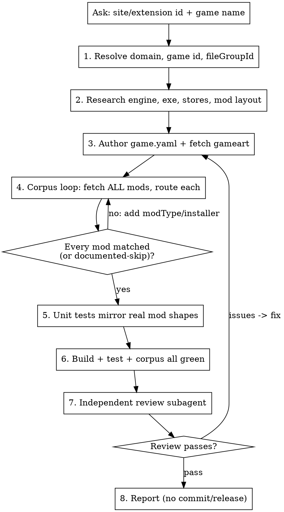

# Implement Game Extension

Creates a new game extension in this monorepo from two inputs — the **Nexus site/extension id**
(the extension's mod page on `nexusmods.com/site`, used as `nexus.modId`) and the **game name**.
Researches the game, writes `games/<id>/game.yaml`, fetches and crops the gameart, supports every
mod currently on the game's Nexus page (verified by the corpus loop), adds unit tests, and gets the
extension building green. It does **not** commit or release — that's left to the maintainer.

Detailed, reusable research methods (store ids, the artwork URL scheme, corpus mechanics, the
template map) live in `references/research-recipes.md` — read it before Step 2.

## Workflow



## Inputs

Ask the user for exactly two things up front:

1. **Site / extension id** — the extension's mod id on `nexusmods.com/site` (becomes `nexus.modId`).
2. **Game name** — e.g. `Solarpunk`, `007: First Light`.

Derive everything else. Only ask again when research is genuinely inconclusive (e.g. the domain
can't be confirmed, or `fileGroupId` can't be resolved).

## Step 0: Preconditions

- `NEXUS_API_KEY` is set in the environment (needed for the v1/v2 Nexus APIs and corpus fetch).
  Check with `echo $NEXUS_API_KEY` (length only — never print it).
- The shared toolchain is built: `pnpm init-gdl` (produces `gdl/dist/cli.js`).
- You're on a branch, not `main`.

A finished game is just `games/<id>/game.yaml` + `games/<id>/gameart.webp` (plus `src/hooks.ts`
**only** if `game.yaml` references a hook). No per-game `package.json`, `vitest.config`, or workflow.

## Step 1: Resolve identifiers

- **Domain + game id**: guess the domain from the name (lowercase, strip spaces/punctuation) and
  verify via `GET https://api.nexusmods.com/v1/games/<domain>.json` (recipe §1). This confirms the
  name and gives the numeric **game id** (used for artwork) and the mod count. If it 404s or the
  name doesn't match, ask the user for the domain.
- **`nexus.modId`** = the site/extension id the user gave.
- **`nexus.fileGroupId`**: resolve from the site mod (recipe §4); if it can't be resolved, ask.

## Step 2: Research the game

Read `references/research-recipes.md`, then gather:

- **Engine, executable, project folder, mod layout** — from the web (store/mod pages, "UE4SS / pak
  mods" searches) and, if the game is installed locally, by inspecting the Steam install: locate it
  via `libraryfolders.vdf` + `appmanifest_<appid>.acf`, then check for `Engine/`,
  `*/Binaries/Win64/*-Shipping.exe`, `Content/Paks` (`.pak`/`.utoc`/`.ucas` ⇒ UE IoStore), and the
  exe's version metadata.
- **Store ids** — steam app id, epic `AppName` (egdata), xbox `PackageIdentityName` (displaycatalog),
  each via recipe §2. Steam alone is enough to ship; add epic/xbox only with confirmed ids. Never
  invent an id — omit the store instead.
- **Closest template** — pick from the recipe §6 template map (subnautica2 / solarpunk / gothic /
  paralives, or "non-UE → from scratch").

If research can't pin down the engine, executable, or a store id you intend to include, ask the user
rather than guessing.

## Step 3: Author game.yaml + gameart

Scaffold `games/<id>/game.yaml` by copying the closest template (Step 2) and adapting it. Required
shape:

```yaml
gdl: 1
version: 0.0.1
game:
  id: <domain>
  name: <Game Name>
  executable: <Launcher>.exe
  requiredFiles: [<Launcher>.exe]
  logo: gameart.webp
  nexusDomain: <domain>
  details:
    steamAppId: <id>
    epicAppId: "<AppName>"       # omit if not confirmed
    supportsSymlinks: true
    gameProjectFolder: <ProjectFolder>
stores:
  steam: "<id>"                  # + epic/xbox when confirmed (recipe §2)
context: { ... }                 # arch/gamePath storeBranch + derived paths (copy template)
modTypes: [ ... ]
installers: [ ... ]
setup:
  ensureDirs: [ ${pakModsPath} ]
toolbarActions:
  - { id: open-nexus-page, title: Open Nexus Page, priority: 200, target: { openUrl: "https://www.nexusmods.com/<domain>" } }
nexus:
  modId: <site id>
  fileGroupId: <group id>
  displayName: <Game Name> Support for Vortex
tests:
  corpus: nexus
  cases: []                      # filled in Step 5
validators: []                   # filled in Step 4
```

- Add `src/hooks.ts` **only** if `game.yaml` references a hook (e.g. `discovery.version: { hook }`
  for a non-UTF-8 version file, or `events.did-deploy` for UE4SS `mods.txt` regen) — copy and adapt
  `games/subnautica2/src/hooks.ts`.
- **Gameart**: query `game{ id artworkSchema }`, download the `hero` image, and crop/resize to a
  **640×360** 16:9 WebP at `games/<id>/gameart.webp` (recipe §3). Verify dimensions with `file`.

## Step 4: Corpus loop — support every current mod

This is the core. With `tests.corpus: nexus`:

```sh
pnpm nx run <id>:test-corpus -- --fetch
```

This fetches every published mod's file-listing for the `nexusDomain` and routes each through the
installers. For every **unmatched** or **misrouted** mod:

1. Inspect its cached manifest in `games/<id>/tests/cache/*.json` to see the real file tree.
2. Add or adjust `modTypes` + `installers` so it routes to the correct location.
3. Re-run and confirm no regressions on the already-matched mods.

Iterate until **every published mod matches the correct installer**, or is intentionally
unsupported with a documented reason. The bar for "intentionally unsupported" is high — only genuine
non-mod-manager content (save files, standalone tools, docs-only uploads). When in doubt, support it.

Add `validators` asserting the key routings (e.g. `dwmapi.dll → ue4ss-injector`,
`ReShade.ini → reshade`, `**/*.utoc` without `.pak → pak-iostore`). A validator must be able to
fail — don't write one that passes for any input.

## Step 5: Unit tests

Add a `tests.cases` entry for each real mod category found in Step 4, using the actual archive
shapes (e.g. the exact `Better Stacks/0_BetterStacks_P.pak` triplet). Each case asserts `matched`,
`modType`, and the resolved `plan`. Run:

```sh
pnpm nx run <id>:test
```

These are deterministic and run in CI (the corpus is local-only), so they're the regression guard.

## Step 6: Build & verify

```sh
pnpm nx run <id>:build                  # "build ok"
pnpm nx run <id>:test                   # unit cases green
pnpm nx run <id>:test-corpus -- --fetch # all mods matched, validators pass
```

Confirm `games/<id>/dist/info.json` has the right `version` and a `<id>-vortex-v<version>.zip` is
produced by `pnpm nx run <id>:package`. Optionally smoke-test discovery by copying `dist/*` into the
local Vortex `plugins/game-<id>/` and launching Vortex.

## Step 7: Independent review

Spawn a clean-context review subagent (model `sonnet`) that reads the result fresh:

```
Tool: Agent
  model: sonnet
  description: "Review new game extension"
  prompt: |
    Review the new Vortex game extension at games/<id>/ in C:\oss\gdl-games. Verify:
    1. game.yaml is well-formed; `pnpm nx run <id>:build` succeeds.
    2. Store ids match what Vortex actually matches: steam=app id, epic=manifest AppName,
       xbox=package Identity Name (not the 9N store id). Flag any guessed/placeholder id.
    3. `pnpm nx run <id>:test` passes and the tests.cases mirror real mod shapes (not trivial).
    4. `pnpm nx run <id>:test-corpus -- --fetch` shows every published mod matched (or an
       intentional, documented skip) and validators pass.
    5. Every validator can actually fail (trace a bad input). Flag vacuous ones.
    6. gameart.webp exists and is 640x360.
    Report PASS, or ISSUES with specific file:line problems. Be strict.
```

Fix anything it flags and re-review until it passes.

## Step 8: Report & hand off

Summarize: domain, game id, stores, engine/template used, mod count and how each routed,
tests added, and the green build. **Do not commit, push, or tag** — because the `nexus` ids are
real, pushing a version bump to `main` triggers a Nexus release. Tell the maintainer the extension
is ready and they can commit/push (and bump `version`) when they want to release.

## Conventions

- Run Nx via `pnpm nx …` (it's a local dependency — bare `nx` needs a global install). The corpus
  target is `test-corpus` (hyphen); the underlying gdl CLI subcommand is `test:corpus`.
- Never print the `NEXUS_API_KEY` value.
- Don't invent store/nexus ids. Omit a store, or ask, rather than guess.
