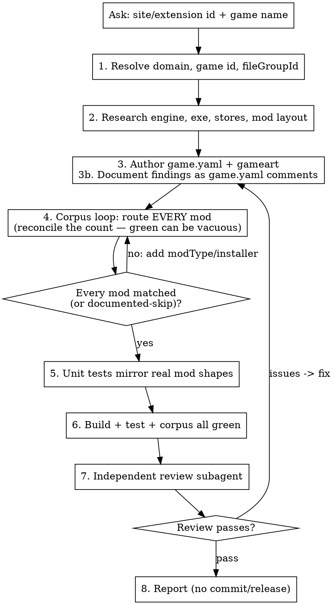

# Implement Game Extension

Creates a new game extension in this monorepo from two inputs — the **Nexus site/extension id**
(the extension's mod page on `nexusmods.com/site`, used as `nexus.modId`) and the **game name**.
Researches the game, writes `games/<id>/game.yaml`, downloads the gameart tile, supports every
mod currently on the game's Nexus page (verified by the corpus loop), adds unit tests, and gets the
extension building green. It does **not** commit or release — that's left to the maintainer.

**Read first:** [`gdl/README.md`](../../../gdl/README.md) is authoritative for the `game.yaml` DSL
and [`docs/corpus-manifests.md`](../../../docs/corpus-manifests.md) for how corpus verification
works and fails. This skill covers only how to research a game and drive it to green.

Reusable research methods (store ids, the artwork URL scheme, the template map) live in
`references/research-recipes.md` — read it before Step 2.

## Workflow


```dot
digraph implement {
  rankdir=TB; node [shape=box];
  inputs   [label="Ask: site/extension id + game name"];
  resolve  [label="1. Resolve domain, game id, fileGroupId"];
  research [label="2. Research engine, exe, stores, mod layout"];
  author   [label="3. Author game.yaml + gameart\n3b. Document findings as game.yaml comments"];
  corpus   [label="4. Corpus loop: route EVERY mod\n(reconcile the count — green can be vacuous)"];
  covered  [label="Every mod matched\n(or documented-skip)?" shape=diamond];
  units    [label="5. Unit tests mirror real mod shapes"];
  build    [label="6. Build + test + corpus all green"];
  review   [label="7. Independent review subagent"];
  ok       [label="Review passes?" shape=diamond];
  report   [label="8. Report (no commit/release)"];

  inputs -> resolve -> research -> author -> corpus -> covered;
  covered -> corpus [label="no: add modType/installer"];
  covered -> units [label="yes"];
  units -> build -> review -> ok;
  ok -> author [label="issues -> fix"];
  ok -> report [label="pass"];
}
```

## Inputs

Ask the user for exactly two things up front:

1. **Site / extension id** — the extension's mod id on `nexusmods.com/site` (becomes `nexus.modId`).
2. **Game name** — e.g. `Solarpunk`, `007: First Light`.

Derive everything else. Only ask again when research is genuinely inconclusive (e.g. the domain
can't be confirmed, or `fileGroupId` can't be resolved).

## Step 0: Preconditions

- `NEXUS_API_KEY` is set in the environment (needed for the v1/v2 Nexus APIs and corpus fetch).
  Check with `echo $NEXUS_API_KEY` (length only — never print it).
- The shared toolchain is built: `pnpm init-gdl` (produces `gdl/dist/cli.js`).
- You're on a branch, not `main`.

A finished game is just `games/<id>/game.yaml` + `games/<id>/gameart.webp` (plus `src/hooks.ts`
**only** if `game.yaml` references a hook). No per-game `package.json`, `vitest.config`, or workflow.

## Step 1: Resolve identifiers

- **Domain + game id**: guess the domain from the name (lowercase, strip spaces/punctuation) and
  verify via `GET https://api.nexusmods.com/v1/games/<domain>.json` (recipe §1). This confirms the
  name and gives the numeric **game id** (used for artwork) and the mod count. If it 404s or the
  name doesn't match, ask the user for the domain.
- **`nexus.modId`** = the site/extension id the user gave.
- **`nexus.fileGroupId`**: resolve from the site mod (recipe §4); if it can't be resolved, ask.

## Step 2: Research the game

Read `references/research-recipes.md`, then gather:

- **Engine, executable, project folder, mod layout** — from the web (store/mod pages, "UE4SS / pak
  mods" searches) and, if the game is installed locally, by inspecting the Steam install: locate it
  via `libraryfolders.vdf` + `appmanifest_<appid>.acf`, then check for `Engine/`,
  `*/Binaries/Win64/*-Shipping.exe`, `Content/Paks` (`.pak`/`.utoc`/`.ucas` ⇒ UE IoStore), and the
  exe's version metadata.
- **Store ids** — steam app id, epic `AppName` (egdata), xbox `PackageIdentityName` (displaycatalog),
  each via recipe §2. Steam alone is enough to ship; add epic/xbox only with confirmed ids. Never
  invent an id — omit the store instead.
- **Closest template** — pick from the recipe §6 template map (subnautica2 / solarpunk / gothic /
  paralives, or "non-UE → from scratch").

If research can't pin down the engine, executable, or a store id you intend to include, ask the user
rather than guessing.

## Step 3: Author game.yaml + gameart

Scaffold `games/<id>/game.yaml` by **copying the closest template** (Step 2) and adapting it. Field
semantics — every key, predicate, `take`/`anchor`/`placeAt`, and the built-in facts (`installPath`,
`store`, `arch`, `appDataLocal`, …) — are documented in [`gdl/README.md`](../../../gdl/README.md).
Don't restate them here; copy a template and change what the research in Step 2 established.

The decisions a template *can't* make for you:

- **Which stores to declare.** Steam alone ships. Add `epic`/`xbox` only with confirmed ids
  (recipe §2) — omit rather than guess, and say **why** in a comment (see Step 3b).
- **`executable` / `requiredFiles`.** These are literal relative paths with no glob expansion. If the
  shipping exe is nested (`<Project>/Binaries/Win64/<Game>.exe`) they must include that path; if the
  Xbox build differs (`WinGDK`), a Win64-only value means Xbox won't auto-detect — which is a reason
  to omit the `xbox` store.
- **Whether `src/hooks.ts` is needed** — only if `game.yaml` references a hook (e.g.
  `discovery.version: { hook }` for a non-UTF-8 version file, or `events.did-deploy` for UE4SS
  `mods.txt` regen). Copy and adapt `games/subnautica2/src/hooks.ts`.
- **`version: 0.0.1`** to start. Never bump it as part of authoring — a bump merged to `main`
  publishes to Nexus.
- **Gameart**: download the **tile** image to `games/<id>/gameart.webp` and keep it **as-is** — no
  cropping or re-encoding (recipe §3):
  `curl -s -o games/<id>/gameart.webp https://images.nexusmods.com/images/games/v2/<gameId>/tile.jpg`
  Verify with `file games/<id>/gameart.webp` that it's a real WebP (tiles are portrait, e.g. 400×600).

## Step 3b: Document as you go

Per-game research lives in **`#` comment blocks inside `game.yaml`** — not in a separate file.
**Do not create `games/<id>/README.md`.** Rationale sits on the line it explains, so it can't drift.

Exemplars: `games/solarpunk/game.yaml`, `games/halocampaignevolved/game.yaml`.

Write, as you learn it:

- A **header block** at the top: game (+ developer), engine and version, project folder, and which
  mod categories are supported.
- **Provenance for every non-obvious value** — e.g.
  `# verified against the Steam depot manifest for app 2806050 (manifest 8153709523381701809)`.
- **`# unverified — confirm on a real install`** on anything you inferred rather than observed. A
  wrong path often still builds and tests green, so an honest marker is the only warning.
- **Omission rationale** — why `epic`/`xbox` is absent. Silent omission reads as an oversight.
- **Per-installer banners** giving the priority, what it matches, and *why each `unless` arm exists*,
  citing real mod ids as evidence.
- A **corpus-state note** if coverage is incomplete or the cache was hand-generated (precedent:
  `games/assassinscreedblackflagresynced/game.yaml`).

## Step 4: Corpus loop — support every current mod

The corpus routes **real** published mods through your installers. It is a *discovery* tool: what it
finds must be promoted into `tests.cases` (Step 5), because the cache is gitignored and CI never
runs the corpus.

> **A green corpus run does not mean it worked.** An all-failed fetch prints `✖` lines and
> **exits 0**; an empty cache prints `no archives in tests/cache/ — nothing to do` and also exits 0.
> Read [`docs/corpus-manifests.md`](../../../docs/corpus-manifests.md) before trusting any result.

Do these in order:

1. **Get the real mod count** — `mods` from `GET https://api.nexusmods.com/v1/games/<domain>.json`.
   You need it to tell success from silence.
2. **Fetch.** Add `--limit 100` on a large catalogue, or `--mods 1,2,3` to scope:
   ```sh
   pnpm nx run <id>:test-corpus -- --fetch
   ```
3. **Reconcile.** Compare `T` in `summary: N matched, M unmatched, K failed, T total` against the
   count from (1). `T=0`, `0 matched`, or `nothing to do` are **FAILURES, not passes**.
4. **If manifests 404** (currently expected for any upload after ~11 June 2026), generate listings
   from the archives instead, then route them locally — note the **absent** `--fetch`:
   ```sh
   node tools/corpus/list-archive.mjs --domain <domain> --game-id <gameId> --all \
     --out games/<id>/tests/cache
   pnpm nx run <id>:test-corpus
   ```
5. **Only then iterate** on unmatched/misrouted mods: inspect the cached listing, adjust
   `modTypes` + `installers`, re-run, and confirm no regressions on already-matched mods.

Iterate until every published mod matches the correct installer, or is intentionally unsupported
with a documented reason. The bar is high — see the list of legitimate non-matches in
`docs/corpus-manifests.md`. When in doubt, support it.

Add `validators` asserting the key routings (e.g. `dwmapi.dll → ue4ss-injector`,
`ReShade.ini → reshade`, `**/*.utoc` without `.pak → pak-iostore`). A validator must be able to
fail — don't write one that passes for any input.

### Mod categories that install-dir-shaped rules miss

Copying a pak-based template is **not sufficient**. On `halocampaignevolved`, 11 of 38 real mods were
unmatched under solarpunk-parity rules. Check explicitly for:

- **Config-file tweaks** (`Engine.ini`) — UE reads user config from
  `${appDataLocal}/<ProjectFolder>/Saved/Config/<TargetPlatform>`, **not** the install dir. This was
  the single most common category on that game (5 of 38, plus another appearing mid-review).
  - **The `<TargetPlatform>` leaf varies per game/build** — `Windows` (UE5 unified),
    `WindowsClient` (client-only), `WindowsNoEditor` (UE4). **Verify it against a real install** or
    ask; do not copy another game's. Assuming `WindowsClient` for Halo was wrong — it's `Windows`.
  - Authors ship **both** `Engine.ini` and `engine.ini` — brace-match both spellings.
  - Keep the validator's `placement` loose (`**/Saved/Config/**`) so it doesn't bake in the leaf.
  - **Add the config dir to `setup.ensureDirs`.** UE creates it on first launch and does *not*
    ship `Engine.ini` at all (verified: Meteorite and Subnautica2 have only
    `GameUserSettings.ini`), so deploying before first launch hits a missing target — the
    "Deployment target unknown" failure fixed for `games/paralives`. Any deploy target outside
    the install dir needs this.
- **Asset / media replacement** — a bare file overwriting shipped content (e.g.
  `FMS_MainMenuBackground.mp4`), needing its own modType pointing at that content subfolder
  (6 of 38).
- **Both need `unless` guards** excluding `**/*.pak`, `**/*.utoc`, `**/*.dll`, `**/*.lua` and
  game-relative trees (`<ProjectFolder>/**`, `Engine/**`), so a mod bundling a config *alongside* a
  pak keeps its pak routing instead of being reduced to a config drop. **Add a `tests.cases` entry
  asserting that guard**, or it is untested.

Working reference: `games/halocampaignevolved/game.yaml` (`configPath`/`menuMoviePath` in `context`,
the `config-ini` and `menu-movie` installers, and their validators). `${appDataLocalLow}` also
exists — see `games/paralives/game.yaml`.

## Step 5: Unit tests

Add a `tests.cases` entry for each real mod category found in Step 4, using the **actual archive
shapes** (e.g. the exact `Better Stacks/0_BetterStacks_P.pak` triplet) — never invented ones. Each
case asserts `matched`, `modType`, and the resolved `plan`. Note the real mod id in a comment so the
shape can be re-checked later.

```sh
pnpm nx run <id>:test
```

These are deterministic and run in CI, whereas the corpus is local-only and its cache is gitignored
— so **these cases are the only durable regression guard**. Every category the corpus revealed must
appear here, including one case per `unless` guard that would fail if the guard were removed.

## Step 6: Build & verify

```sh
pnpm nx run <id>:build                  # "build ok"
pnpm nx run <id>:test                   # unit cases green
pnpm nx run <id>:test-corpus -- --fetch # see Step 4: reconcile the count, don't just read "matched"
```

Confirm `games/<id>/dist/info.json` has the right `version` and a `<id>-vortex-v<version>.zip` is
produced by `pnpm nx run <id>:package`. Optionally smoke-test discovery by copying `dist/*` into the
local Vortex `plugins/game-<id>/` and launching Vortex.

## Step 7: Independent review

Spawn a clean-context review subagent (model `sonnet`) that reads the result fresh:

```
Tool: Agent
  model: sonnet
  description: "Review new game extension"
  prompt: |
    Review the new Vortex game extension at games/<id>/ (repo root is the current working
    directory). Verify:
    1. game.yaml is well-formed; `pnpm nx run <id>:build` succeeds.
    2. Store ids match what Vortex actually matches: steam=app id, epic=manifest AppName,
       xbox=package Identity Name (not the 9N store id). Flag any guessed/placeholder id.
    3. `pnpm nx run <id>:test` passes and the tests.cases mirror real mod shapes (not trivial).
    4. Corpus coverage is real, not vacuous: compare the `summary: … T total` line against the
       `mods` count from api.nexusmods.com/v1/games/<domain>.json. `0 matched`, `T=0`, or
       "nothing to do" is a FAILURE even though it exits 0 (see docs/corpus-manifests.md).
       Any shortfall must be documented in game.yaml comments.
    5. Every validator can actually fail (trace a bad input). Flag vacuous ones.
    6. Any path that was assumed rather than observed is flagged `# unverified` — especially a UE
       user-config leaf (Saved/Config/<TargetPlatform> varies per game) and store-specific exe
       paths. A wrong path can build and test green.
    7. game.yaml carries the comment blocks from Step 3b (header, provenance, omission rationale).
       There must be no games/<id>/README.md.
    8. gameart.webp exists and is a valid WebP of the game's tile.jpg, saved uncropped (tiles are
       portrait, e.g. 400x600). Minor art issues are low severity — it's a fallback Vortex only uses
       when it can't load tile art from the site.
    Report PASS, or ISSUES with specific file:line problems. Be strict.
```

Fix anything it flags and re-review until it passes.

## Step 8: Report & hand off

Summarize: domain, game id, stores, engine/template used, mod count and how each routed,
tests added, and the green build. **Do not commit, push, or tag** — because the `nexus` ids are
real, pushing a version bump to `main` triggers a Nexus release. Tell the maintainer the extension
is ready and they can commit/push (and bump `version`) when they want to release.

## Conventions

- Run Nx via `pnpm nx …` (it's a local dependency — bare `nx` needs a global install). The corpus
  target is `test-corpus` (hyphen); the underlying gdl CLI subcommand is `test:corpus`, which also
  accepts `--limit N` and `--mods 1,2,3` (pass them after `--`).
- Never print the `NEXUS_API_KEY` value.
- Don't invent store/nexus ids, or any path. Omit, mark `# unverified`, or ask — rather than guess.
- Per-game research goes in `game.yaml` comments (Step 3b). No per-game README.
- `gdl/` is a **separate repository** (a submodule). Don't change it as part of authoring a game —
  propose it separately.
- Never commit, push, tag, or bump `version:`. A version bump merged to `main` publishes to Nexus.

## Reference

- [`gdl/README.md`](../../../gdl/README.md) — the DSL: every `game.yaml` key, predicates,
  `take`/`anchor`/`placeAt`, built-in facts, CLI flags. **Authoritative; this skill does not restate it.**
- [`README.md`](../../../README.md) — repo setup, Nx targets, release process.
- [`docs/corpus-manifests.md`](../../../docs/corpus-manifests.md) — corpus mechanics, the
  silent-pass trap, the manifest outage, and the offline workaround.
- `references/research-recipes.md` — the curl recipes and the template map.
